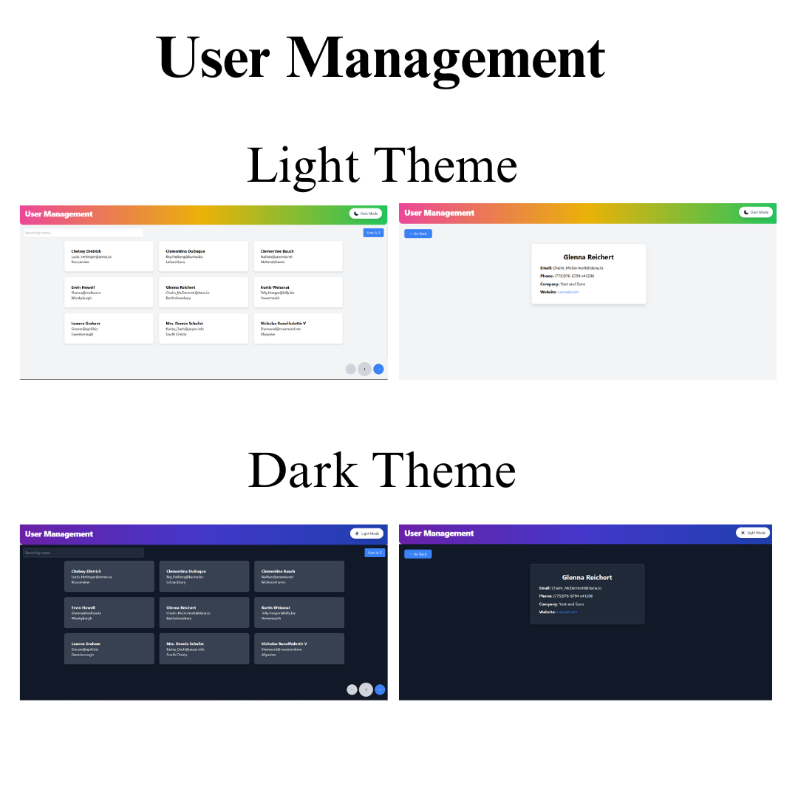

# WPA

# React.js Frontend Developer Assignment

## Objective
Develop a React.js application that fetches and displays a list of users from an API, allows searching and filtering, and provides a detailed view for each user.

## Preview of the Application


---

## Deployed Link
The application is deployed and can be accessed https://wpa-kappa.vercel.app/.

## Features Implemented

### 1. Project Setup
- Built using **React.js** with functional components and hooks.
- **React Router** is used for navigation between pages.
- Styling is done using **CSS**, **Tailwind CSS**, and/or **Material-UI**.

### 2. Home Page
- Displays a list of users fetched from this API:  
  `https://jsonplaceholder.typicode.com/users`
- Each user's **name**, **email**, and **city** are displayed.
- **Search bar** to filter users by name.
- Sorting functionality by name (**A-Z** and **Z-A**).
- Clicking on a user navigates to their detailed profile page.

### 3. User Detail Page
- Displays full user details:
  - Name
  - Email
  - Phone
  - Company Name
  - Website
- Includes a **"Go Back"** button to return to the home page.

### 4. Additional Features
- **State management** implemented using React Context API / Redux.
- Loading and error handling while fetching data.
- Fully responsive design for both mobile and desktop.

### Bonus Features
- **Dark/Light mode toggle** implemented.
- Added **pagination** to the user list.
- Deployed on **Netlify/Vercel** for easy access.

## Installation and Setup

1. Clone the repository:
   ```bash
   git clone <repository-link>
   cd <repository-folder>

2. Install dependencies:
    npm install

3. Start the development server:
    npm start

4. Open the application in your browser:
    http://localhost:3000
